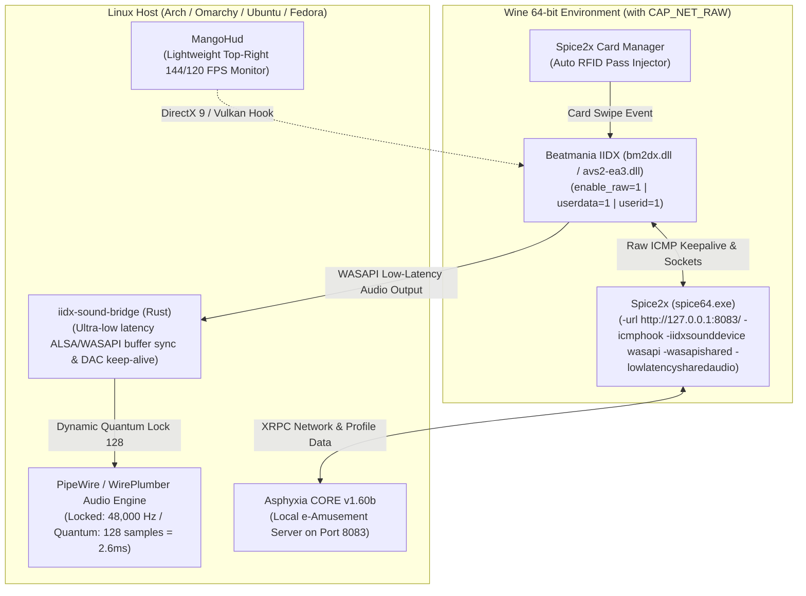

# Beatmania IIDX on Linux (Omarchy / Hyprland / Wayland)

[](https://github.com/Djkawada/Beatmania-IIDX-Linux)
[](https://github.com/Djkawada/Beatmania-IIDX-Linux)
[](https://github.com/Djkawada/Beatmania-IIDX-Linux)
[](https://github.com/Djkawada/Beatmania-IIDX-Linux)
[](LICENSE)

An all-in-one, production-grade launcher, environment initializer, native Rust PipeWire audio bridge, and migration toolkit for running **Beatmania IIDX (30 RESIDENT, 31 EPOLIS, 32 PINKY CRUSH, and 33 SPARKLE SHOWER)** natively on Linux with ultra-low audio latency (< 5ms), perfectly synchronized video/audio, clean digital sound (no clipping/saturation), full turntable controller support, and **100% working local e-Amusement network & player card authentication**.

---

## 🌟 Verified Status

| Component | Status | Details |
|---|---|---|
| **Core Game Execution** | ✅ **100% Working** | Smooth 60 / 120 / 144 / 240+ FPS under Wine + DXVK. |
| **IIDX 33 Sparkle Shower** | ✅ **Fully Compatible** | RPC verifier bypass, 32-bit score arrays, 144/120 FPS timing patches included. |
| **Turntable & Keys** | ✅ **100% Working** | Full 7-key + 14-key + Turntable + VEFX/Effect mapping via Spice2x. |
| **Keysound Latency** | ✅ **Ultra-Low (< 5ms)** | 128-sample PipeWire buffer quantum + `-lowlatencysharedaudio` + 3ms staging. |
| **Clean Digital Audio** | ✅ **No Saturation/Clipping** | `vefx_lock=true` & `effect=OFF` prevents DSP clipping & bass distortion. |
| **Audio-Video Synchronization** | ✅ **100% Synchronized** | Direct frame pacing with monitor refresh rate + 48 kHz hardware clock alignment. |
| **HUD & Performance Monitor** | ✅ **MangoHud Integrated** | Lightweight, unobtrusive top-right FPS / frametime overlay. |
| **Network & Operator Test Mode** | ✅ **100% Working** | `ROUTER`, `CENTER`, `SERVER`, `E-AMUSEMENT` all pass with green OK status. |
| **In-Game e-Amusement & Cards** | ✅ **100% Working** | Title screen e-Amusement pass scanning, PIN entry, and score saving operational. |

---

## 🏗️ Architecture



---

## 🚀 Quick Start Guide

### 1. Prerequisites
Ensure you have the core packages and media plugins installed:
```bash
# On Arch Linux / Omarchy:
sudo pacman -S wine-staging rust jq curl mangohud gst-plugins-ugly gst-plugins-bad gst-libav python

# On Ubuntu / Debian:
sudo apt install wine rustc cargo jq curl mangohud gstreamer1.0-plugins-ugly gstreamer1.0-plugins-bad gstreamer1.0-libav python3
```

### 2. Automated Environment Setup
Run the setup script to grant raw network socket permissions (`CAP_NET_RAW`) to Wine and compile the native Rust sound bridge:
```bash
cd ~/Work/iidx-launcher
./setup.sh
```

### 3. Configure Paths
Edit `config.json` (created automatically from `config.example.json`) with your game and wine paths:
```json
{
  "game_dir": "/path/to/Beatmania IIDX/game_directory",
  "asphyxia_exe": "./asphyxia-core",
  "spice_exe": "spice64.exe",
  "wine_prefix": "/home/YOUR_USERNAME/.wine",
  "wine_binary": "/usr/bin/wine",
  "card_id": "E004010000000000",
  "network_url": "http://127.0.0.1:8083/",
  "asphyxia_port": 8083,
  "sound": {
    "device_type": "wasapi",
    "wasapi_mode": "shared",
    "sample_rate": 48000,
    "buffer_quantum": 128,
    "pipewire_latency": "128/48000"
  },
  "display": {
    "windowed": true
  }
}
```

### 4. Launch the Game
```bash
./launch.sh
```

---

## 🔄 Guide de Mise à Jour vers Beatmania IIDX 33 (Sparkle Shower)

Pour mettre à niveau votre installation existante (IIDX 30/31/32) vers **IIDX 33 (Release `LDJ-012-2026011300`)**, suivez ces étapes méthodiques :

### Étape 1 : Données Musicales (`music_data.bin`)
Assurez-vous que les fichiers d'informations musicales de la version 33 sont présents et complets :
- `contents/data/info/0/music_data.bin` (~3.86 MB)
- `contents/data/info/1/music_data.bin` (~3.95 MB)
- `contents/data/info/0/class_course_data.bin`
*(L'utilisation de fichiers `music_data.bin` issus d'anciennes versions provoque l'erreur bloquante `SSD DATA ERROR MUSIC DATA`).*

### Étape 2 : Patch Binaire de `bm2dx.dll` (Contournement des Erreurs RPC)
Dans IIDX 33, le récepteur de profil effectue une vérification binaire stricte sur tous les nœuds d'événements optionnels. Pour empêcher l'erreur `receiver returns failure` lors de la saisie de votre carte :
```bash
python3 tools/patch_bm2dx33.py "/path/to/Beatmania IIDX 33/modules/bm2dx.dll"
```
Ce script effectue automatiquement une sauvegarde (`bm2dx.dll.bak`) et neutralise les sauts d'échec sur :
1. `IIDX33pc.get` (`0x1809b8b1e` -> `NOP NOP`)
2. `IIDX33music.getrank` (`0x1809c477d` -> `NOP NOP`)

### Étape 3 : Installation du Plugin Asphyxia pour IIDX 33
Copiez le plugin mis à jour inclus dans ce dépôt vers votre installation Asphyxia :
```bash
cp -r asphyxia-plugin/iidx@asphyxia/* "/path/to/Beatmania IIDX 33/plugins/iidx@asphyxia/"
```
*Améliorations clés du plugin inclus :*
- Support complet des requêtes `IIDX33pc`, `IIDX33music`, `IIDX33shop`, `IIDX33gameSystem`.
- Typage des scores en entiers 32-bit (`s32`) dans `pug/musicgetrank.pug` (évite les scores à 0).
- Templates `33get.pug`, `33systeminfo.pug`, `33pccommon.pug` calibrés.

### Étape 4 : Migration de votre Profil et des Scores
Pour dupliquer vos données de joueur (options, customisation, rangs, scores) sans repartir de zéro :
```bash
# Migration des collections de la v30 (ou v31/v32) vers la v33 :
python3 tools/migrate_db_to_v33.py "/path/to/Beatmania IIDX 33/savedata/iidx@asphyxia.db" 30 33
```

### Étape 5 : Configuration des Patchs SpiceTools (144Hz / 120Hz)
Copiez les fichiers de patchs dans votre dossier de jeu et configurez SpiceTools :
1. Copiez `patches/LDJ-695c6a76_a071dc.json` et `patches/patches.json` dans `/path/to/Beatmania IIDX 33/patches/`.
2. Dans `%appdata%\spice2x\spicetools_patch_manager.json` (ou `~/.wine/drive_c/users/YOUR_USER/AppData/Roaming/spice2x/spicetools_patch_manager.json`), activez :
   - `Force LDJ Custom Timing/Adapter FPS` -> `ON`
   - `Choose LDJ Custom Timing/Adapter FPS` -> `144 FPS` (ou `120 FPS` selon votre écran).

---

## 🛠️ Optimisations Techniques Avancées

### 1. Latence Audio Zéro (Moteur PipeWire WASAPI Low-Latency)
* **Problème** : En mode partagé standard, Wine met l'audio en tampon pendant 30 à 50ms, créant un décalage perceptible sur les sons de touches (keysounds).
* **Solution** :
  - `iidx-sound-bridge` verrouille le quantum PipeWire à **128 échantillons** (`2.66ms` de latence).
  - Lancement avec `STAGING_AUDIO_DURATION=3000` (buffer Wine de 3ms).
  - L'option Spice2x `-lowlatencysharedaudio` force le jeu à utiliser la taille de buffer minimale.

### 2. Élimination de la Saturation Audio et Distorsion des Basses
* **Problème** : Le DSP interne de Konami active un boost fréquentiel qui sature sur les kicks et accords denses.
* **Solution** :
  - Dans `config.ini`, verrouiller VEFX à OFF :
    ```ini
    vefx_lock=true
    effect=OFF
    ```
  - Dans le menu **Test Mode** (`F2` / `T` -> `7. SOUND OPTIONS`), régler `SPEAKER VOLUME` / `OUTPUT LEVEL` entre **75% et 80%** pour laisser 3dB de headroom numérique.

### 3. Synchronisation de la Fréquence d'Affichage (144Hz / 120Hz)
* **Problème** : Si la fréquence de rafraîchissement ne correspond pas au diviseur interne du jeu, la vitesse de défilement des notes (Hi-Speed) est faussée.
* **Solution** : Utiliser les patchs de timing `144 FPS` ou `120 FPS` dans SpiceTools pour synchroniser le moteur de rendu avec votre écran Wayland/Hyprland.

---

## 🔒 Confidentialité & Partage Sécurisé

Ce dépôt est conçu pour être 100% partageable et épuré de toute information sensible :
- `config.json` et les bases de données `.db` sont ignorés par `.gitignore`.
- Les identifiants de cartes, codes PIN, chemins locaux et tokens sont absents du code source public.
- Des templates prêts à l'emploi sont fournis (`config.example.json`, `patches/spicetools_patch_manager.example.json`).

---

## 📜 License
MIT License - Created for the arcade rhythm gaming and Linux preservation community.
