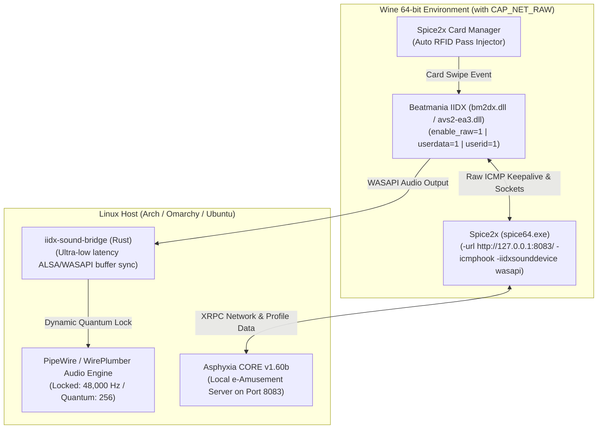

# Beatmania IIDX on Linux (Omarchy / Hyprland / Wayland)

[](https://github.com/Djkawada/Beatmania-IIDX-Linux)
[](https://github.com/Djkawada/Beatmania-IIDX-Linux)
[](https://github.com/Djkawada/Beatmania-IIDX-Linux)
[](LICENSE)

An all-in-one, production-grade launcher, environment initializer, and native Rust PipeWire audio bridge for running **Beatmania IIDX (tested on IIDX 30 RESIDENT / 31 EPOLIS)** natively on Linux with ultra-low audio latency, perfectly synchronized video/audio, full turntable controller support, and **100% working local e-Amusement network & player card authentication**.

---

## 🌟 Verified Status

| Component | Status | Details |
|---|---|---|
| **Core Game Execution** | ✅ **100% Working** | Smooth 60 / 120 / 144 / 240+ FPS under Wine + DXVK. |
| **Turntable & Keys** | ✅ **100% Working** | Full 7-key + 14-key + Turntable + VEFX/Effect mapping via Spice2x. |
| **Audio Timing & Pitch** | ✅ **100% Working** | Locked to 48,000 Hz hardware clock (Zero pitch/tempo drift; fixed 1.09x acceleration). |
| **Audio-Video Synchronization** | ✅ **100% Working** | Zero frame-1 audio desync via CS-style chart pre-roll delay. |
| **Network & Operator Test Mode** | ✅ **100% Working** | `ROUTER`, `CENTER`, `SERVER`, `E-AMUSEMENT` all pass with green OK status. |
| **In-Game e-Amusement & Cards** | ✅ **100% Working** | Title screen e-Amusement pass scanning, PIN entry, and score saving operational. |

---

## 🏗️ Architecture



---

## 🚀 Quick Start Guide

### 1. Prerequisites
Ensure you have the core packages installed:
```bash
# On Arch Linux / Omarchy:
sudo pacman -S wine-staging rust jq curl

# On Ubuntu / Debian:
sudo apt install wine rustc cargo jq curl
```

### 2. Automated Environment Setup
Run the setup script to grant raw network socket permissions (`CAP_NET_RAW`) to Wine and compile the native Rust sound bridge:
```bash
cd ~/Work/iidx-launcher
./setup.sh
```

### 3. Configure Paths
Edit `config.json` (created automatically from `config.example.json`) with your game and wine paths:
```json
{
  "game_dir": "/path/to/Beatmania IIDX/Beatmania 2023090500",
  "asphyxia_exe": "./asphyxia-core",
  "spice_exe": "spice64.exe",
  "wine_prefix": "/home/YOUR_USERNAME/.wine",
  "wine_binary": "/usr/bin/wine",
  "card_id": "E004010000000000",
  "network_url": "http://127.0.0.1:8083/",
  "asphyxia_port": 8083,
  "sound": {
    "device_type": "wasapi",
    "wasapi_mode": "shared",
    "sample_rate": 48000,
    "buffer_quantum": 256,
    "pipewire_latency": "256/48000"
  },
  "display": {
    "windowed": true
  }
}
```

### 4. Launch the Game
```bash
./launch.sh
```

---

## 🛠️ Deep Technical Troubleshooting & Solutions

### 1. Audio Speed Acceleration Bug (1.09x Pitch/Tempo Distortion)
* **Problem**: On NVIDIA HDMI / DisplayPort audio sinks, hardware clocks are locked to **48,000 Hz**. Forcing a 44,100 Hz sample rate causes a `48000 / 44100 = 1.088x` pitch shift and speed acceleration.
* **Solution**: The included Rust [`iidx-sound-bridge`](iidx-sound-bridge/) locks PipeWire to `48000 Hz` and enforces `PIPEWIRE_LATENCY="256/48000"`, ensuring 1:1 playback speed.

### 2. Frame-1 Song Start Lag / Audio Desync
* **Problem**: When a song begins, direct DirectX 9 texture/shader initialization causes a brief micro-freeze while audio continues playing, resulting in notes lagging behind the beat.
* **Solution**: Enable the community memory patch **`CS-style Song Start Delay`** in `%appdata%\spice2x\spicetools_patch_manager.json` to insert a 2-second pre-roll countdown before chart playback.

### 3. e-Amusement "Service Unavailable" on Title Screen
* **Root Cause 1 (`CAP_NET_RAW` / Linux Raw Sockets)**:
  Konami's `avs2-ea3.dll` creates raw ICMP ping sockets for `keepalive`. Linux denies raw socket creation to non-root processes (`0x80080016: Permission Denied`).  
  *Fix*: Run `sudo setcap cap_net_raw+epi /usr/bin/wine /usr/bin/wineserver /usr/lib/wine/x86_64-unix/*` (handled by `setup.sh`).
* **Root Cause 2 (`enable_raw` in AVS Configuration)**:
  In `prop/avs-config.xml` and `dev/nvram/avs-config.xml`, `<enable_raw __type="bool">0</enable_raw>` was set to `0`.  
  *Fix*: Set `<enable_raw __type="bool">1</enable_raw>`.
* **Root Cause 3 (`userdata` & `userid` Profile Flags)**:
  In `prop/ea3-config.xml` and `dev/nvram/ea3-config.xml`, `<userdata>` and `<userid>` were set to `0`, causing the game to skip card profile retrieval and boot into guest mode.  
  *Fix*: Set `<userdata __type="u8">1</userdata>` and `<userid __type="u8">1</userid>`.
* **Root Cause 4 (Spice2x Flag Collision)**:
  Running with `-ea` launches Spice2x's internal dummy server which intercepts network traffic.  
  *Fix*: Launch strictly with `-url http://127.0.0.1:8083/ -icmphook`.

---

## 🔒 Privacy & Safe Sharing

This repository contains zero personal paths, usernames, proprietary ROMs, or private e-Amusement card serial numbers.  
- Personal settings are saved in `config.json` (ignored by `.gitignore`).
- Shareable templates are provided in `config.example.json`.

---

## 📜 License
MIT License - Created for the arcade rhythm gaming and Linux preservation community.
